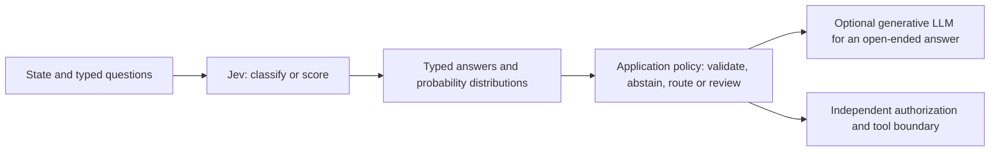

# GettingToKnowJev

A hands-on walkthrough of **Jev**, TypeSafe's structured-decision model, and its LangChain integration. Learn typed questions, probability versus confidence, abstention, model routing, tool-risk gating, evaluation and the agent loop.

Based on the ideas in LangChain's [Building a Harness with Jev](https://www.langchain.com/blog/building-a-harness-with-jev), checked against the official TypeSafe documentation and the installed integration on 2026-09-21. This is original learning material, not a reproduction of the article.

**Start offline.** The runnable demonstrations use the real `langchain-typesafe` client and experimental middleware with a mock HTTP transport, synthetic answers and fake chat models. They make no network calls, execute no shell tools, and do not claim Jev accuracy, inference speed or cost savings. A separate live command makes one explicitly authorized TypeSafe request.

## Quick Start

From this directory, with [uv](https://docs.astral.sh/uv/) installed:

```bash
bash setup.sh
.venv/bin/python walkthrough.py all
.venv/bin/python -m unittest discover -s tests -v
```

Python 3.12 is used locally. On Windows, the equivalent setup is `uv venv --python 3.12 .venv`, followed by `uv pip install --python .venv/Scripts/python.exe -r requirements.lock`; substitute `.venv/Scripts/python.exe` in the examples. Windows execution has not been verified here.

The integration is pinned to **langchain-typesafe 0.0.1a3**, including its `experimental` extra. The beta warning is expected. [requirements.lock](requirements.lock) pins the resolved dependencies. These alpha/experimental APIs can change; do not assume another version has identical middleware behavior.

| Command | What it exercises |
| --- | --- |
| `walkthrough.py demo` | Real request serialization and typed parsing, with synthetic Choice/Score/Noul answers |
| `walkthrough.py routing` | Real `ModelRouterMiddleware` and agent graph, with fake classifier/chat results |
| `walkthrough.py gate` | Real `AutoModeMiddleware`, with a recording-only handler and risk/error fixtures |
| `walkthrough.py eval` | Brier score and threshold trade-offs on explicit synthetic probabilities |
| `walkthrough.py all --save` | All offline lessons, saving the report under ignored `results/` |
| `walkthrough.py live --confirm-live` | One paid-capable API call with the bundled synthetic support ticket |

Read the [walkthrough](docs/walkthrough.md) alongside the code in [walkthrough.py](walkthrough.py). It includes annotated snippets and Mermaid diagrams for each major stage.

## The Boundary



Jev is not a replacement chat-completion endpoint. Its API is `POST https://api.typesafe.ai/v1/systemone`, with `state`, `model` and `questions`. It returns `answers`, not a streamed assistant paragraph. The article's reported 200x/400x improvements are **vendor claims on particular classification comparisons**, not measured results from this project.

A probability is not a permission. Model-risk classification does not replace authentication, authorization, tool allowlists, argument validation, sandboxing, resource limits or human approval for consequential operations. Tool descriptions, retrieved content and prior messages can contain hostile instructions; their presence in model state does not grant authority.

## Live Use

Set `TYPESAFE_API_KEY` privately in your terminal or secret manager using the official [TypeSafe dashboard](https://console.typesafe.ai/keys). Do not paste the key into chat, save it in source, or commit it. This walkthrough does not ask for or inspect secrets during offline runs.

```bash
.venv/bin/python walkthrough.py live --confirm-live --model jev-latest
```

This sends **one request** to the official HTTPS TypeSafe endpoint with the bundled synthetic ticket and three questions. It may incur charges. It reports the resolved model ID, usage and client wall time, but takes no subsequent tool action. `jev-latest` can change; use an available versioned model ID for reproducible evaluation. No private customer ticket or filesystem content is uploaded by this command.

LangSmith tracing is explicitly disabled by this educational runner, including when inherited tracing environment variables are set. The live HTTP clients ignore proxy/base-URL environment overrides and use bounded timeouts. Live provider failures are reported by error class without dumping credentials, request headers or entire provider error bodies. No automatic retry loop is added.

**Live Jev inference has not been run here.** No TypeSafe key, hosted generative-model key, cloud deployment or paid API call is needed to complete the offline lessons. Opting into a live call does not enable shell execution, trading, account changes or an autonomous agent.

## Verified Behavior

13 tests pass on macOS ARM64 / Python 3.12.14. They cover actual HTTP request shape, nested LangChain message conversion, sync/async mock transport, typed answer parsing, conservative triage policies, the real routing graph, Auto Mode threshold/bypass/failure behavior, invalid probabilities and explicit live opt-in.

The observed Auto Mode behavior in the pinned release is important: configured calls with risk **at least 0.5** are blocked; classifier errors propagate without calling the handler; **unlisted tool names bypass classification**. It does not request human approval. The threshold is an implementation constant, not a constructor parameter in this release.

The default router classifies the **latest human message once per agent run**, stores its `ChoiceAnswer`, and uses the chosen model for that run. It does not itself abstain on low confidence or evaluate the full conversation on every model call. The walkthrough distinguishes that upstream behavior from the additional application policy demonstrated for triage.

## Layout

- [walkthrough.py](walkthrough.py): all executable examples and explicit offline/live boundaries.
- [docs/walkthrough.md](docs/walkthrough.md): sequential concepts, code, diagrams and evaluation exercises.
- [tests/test_walkthrough.py](tests/test_walkthrough.py): offline tests; no API keys or network required.
- [setup.sh](setup.sh): isolated installation; it makes no classification calls.

Repository: [eoinjordan/GettingToKnowJev](https://github.com/eoinjordan/GettingToKnowJev). Visibility is not changed by the setup scripts. Model weights are not downloaded or hosted locally; offline fixtures are not an emulation of Jev's learned behavior.