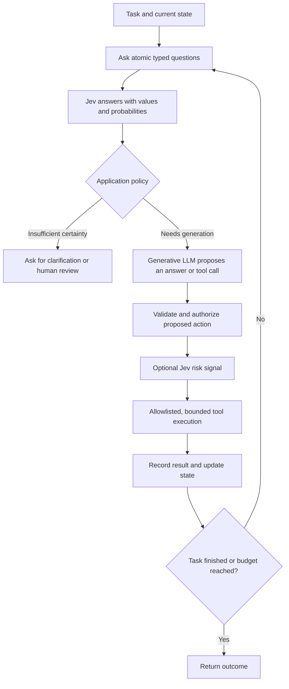
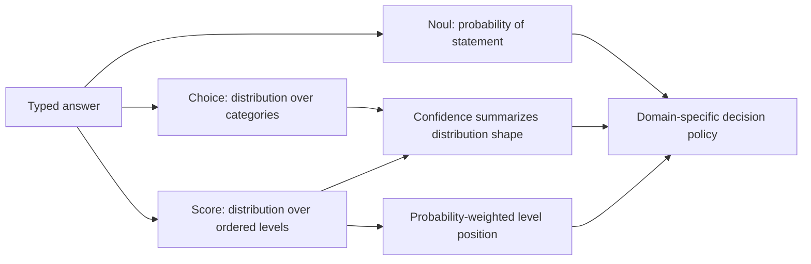
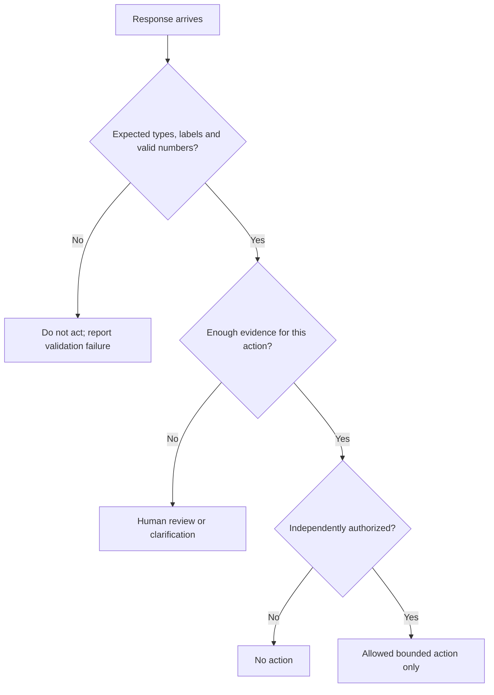
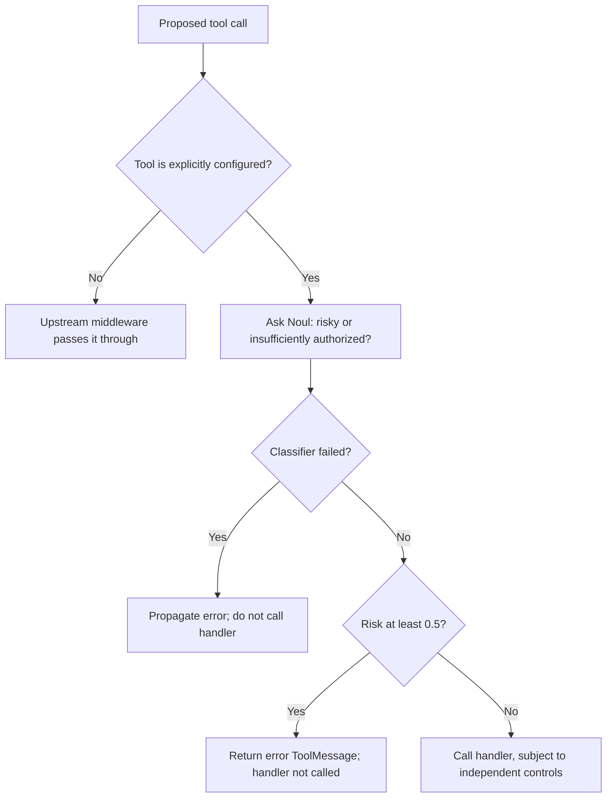
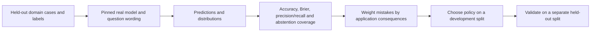

# Getting To Know Jev

Run all commands from the project directory. Start with [setup](../README.md), then `.venv/bin/python walkthrough.py all`. The offline examples below can run in order in `.venv/bin/python`; a block marked live is opt-in and is not run by the tests.

## 1. Locate Jev In The Agent Loop

An agent harness combines model calls, tools, state, stopping conditions and application policy. Some decisions require generative reasoning; others are narrowly defined classification or scoring questions. Jev is intended for the second group.



The diagram is conceptual, not a performance trace. A low-risk answer cannot bypass the authorization boundary. A classifier also adds a network call when hosted; count that latency when deciding whether replacing a generative decision step helps.

**Not the same as the vLLM lab:** there is no locally downloaded Jev model, llama.cpp backend, GPU allocation or token-generation loop under test here. The TypeSafe API's token-usage accounting does not make Jev's outputs equivalent to a streamed chat completion. Its internal architecture and accelerator utilization cannot be inferred from this client's CPU/RAM measurements.

## 2. Define State And Atomic Questions

The request has a shared `state`, a selected `model`, and a mapping of named `questions`. State can be text, structured JSON or LangChain messages. Do not include credentials or private data unless the service and its processing policy are approved for that use.

```python
from walkthrough import QUESTIONS, STATE, offline_classifier

with offline_classifier() as (classifier, captured):
    response = classifier.invoke({"state": STATE, "questions": QUESTIONS})

assert len(captured) == 1
assert captured[0]["model"] == "jev-latest"
assert set(captured[0]["questions"]) == {"department", "urgent", "severity"}
print(captured[0])
```

This invokes the **actual integration** through `httpx2.MockTransport`. No request leaves the process. The returned model is visibly named `OFFLINE-FIXTURE-NOT-JEV-INFERENCE` so synthetic numbers cannot be mistaken for provider results.

The questions in [walkthrough.py](../walkthrough.py) are constructed with the real classes:

```python
from langchain_typesafe import Choice, Noul, Score

urgent = Noul(instructions="Does the stated outage need immediate attention?")
team = Choice(
    instructions="Which team should investigate?",
    criteria={"technical": "A product malfunction", "billing": "An invoice issue", "other": "Neither category"},
)
severity = Score(
    instructions="How much does the issue prevent using the service?",
    criteria=["Cosmetic issue", "Feature failure with a workaround", "Service blocked with no workaround"],
)
assert urgent.type == "noul" and team.type == "choice" and severity.type == "score"
```

Keep each question about one dimension. “Is this urgent, risky and caused by billing?” combines unrelated judgments into one answer. Prefer separate questions and combine them through inspectable application logic.

TypeSafe says questions are evaluated independently against the same state and processed in parallel. That is a provider behavior claim, not statistical independence of their answers: urgency and severity can correlate. Do not multiply their probabilities as if independent without a justified model. Adding questions can also change request bytes, token usage and network cost even if model-side latency changes little.

## 3. Interpret The Three Primitives

| Primitive | Question | Returned values | Common mistake |
| --- | --- | --- | --- |
| Noul | Is a statement true? | `noul`, a value in `[0, 1]` | Treating a probability above zero as true |
| Choice | Which category fits? | Selected label, distribution, confidence | Treating confidence as the selected label's probability |
| Score | Where on an ordered rubric? | Continuous score, level distribution, legend, confidence | Assuming every score is already normalized to `[0, 1]` |

```python
print("Urgency probability:", response.nouls["urgent"].noul)
department = response.choices["department"]
print("Selected team:", department.choice)
print("Selected probability:", department.probabilities[department.choice])
print("Distribution confidence:", department.confidence)

scored = response.scores["severity"]
expected = sum(level * weight for level, weight in scored.probabilities.items())
assert abs(scored.score - expected) < 1e-9
normalized = scored.score / (len(QUESTIONS["severity"].criteria) - 1)
print("Severity raw / normalized:", scored.score, normalized)
```

A three-level Score has levels 0, 1 and 2; the synthetic score 1.9 normalizes to 0.95. It is a weighted position on a rubric, not a 95% probability that a ticket is severe. Different distributions can share the same mean; retain the distribution and confidence.

Noul has **no separate confidence field**. Choice and Score confidence summarize the returned distribution; they are not guarantees of correctness or authorization. Treat calibration as something to evaluate against domain labels, not something proven by the existence of a field named probability.



## 4. Add Abstention And Validation

The walkthrough validates the expected labels, distributions, finite probabilities and Score arithmetic before selecting a triage route. Its thresholds are **teaching choices**, not tuned production defaults.

```python
from walkthrough import demo, triage_policy

policy = triage_policy(response)
assert policy["route"] == "technical"
assert policy["priority"] == "immediate_review"
uncertain = demo()["uncertain_case_policy"]
assert uncertain["route"] == "human_review"
print(policy)
print(uncertain)
```

An urgent but ambiguous ticket still needs prompt review, not an invented department assignment. Having an `other` category and an abstention path prevents a closed choice set from forcing every input into a misleading answer.



A schema-valid response can be semantically wrong. Always assess both protocol validity and decision quality. For high-consequence operations, use the required deterministic checks and human approvals regardless of model confidence.

## 5. Route A Model With LangChain

```bash
.venv/bin/python walkthrough.py routing
```

The runnable example uses `FakeListChatModel` for both candidate models and injects an offline classifier at the real middleware's constructor. The actual LangChain agent graph then chooses the fake fast model. The fixture is not model-driven semantic routing and produces no paid chat-model call.

```python
from walkthrough import routing_demo

routed = routing_demo()
assert routed["classifier_calls"] == 1
assert routed["route_answer"]["choice"] == "fast"
print(routed["message"])
```

For a future live integration, pass genuine configured chat-model objects rather than copying marketing aliases into provider strings. This function defines the wiring but does **not** construct or invoke a live agent in the walkthrough:

```python
from langchain.agents import create_agent
from langchain_typesafe.experimental.middleware import ModelChoice, ModelRouterMiddleware

def build_live_router_agent(base_model, fast_model, powerful_model):
    router = ModelRouterMiddleware(
        choices={
            "fast": ModelChoice(model=fast_model, criteria="Simple, bounded retrieval or extraction"),
            "powerful": ModelChoice(model=powerful_model, criteria="Complex analysis requiring deeper reasoning"),
        },
        instructions="Choose the least costly model suited to the task.",
    )
    return create_agent(base_model, middleware=[router])
```

Constructing the live middleware requires TypeSafe configuration; the chosen chat provider needs its own installed integration and credentials. This project does not install or call a hosted chat provider for you.

Observed in `0.0.1a3`: the router examines the latest `HumanMessage` once before the run, stores the full `ChoiceAnswer` in `model_route`, and substitutes that model on subsequent model calls. Classifier failures propagate. It does not reroute every thought/tool cycle and does not itself add a low-confidence fallback. Latest-message-only routing can miss constraints from earlier context; evaluate that behavior against your intended workload.

## 6. Understand Auto Mode Before Trusting It

```bash
.venv/bin/python walkthrough.py gate
```

This runs the actual middleware method with request-shaped fixtures and a handler that only records invocation and returns a fixed `ToolMessage`. It does not register or execute `bash`, write files, send messages, change permissions or call a remote tool.

```python
from walkthrough import tool_gate_case

low = tool_gate_case(0.1)
boundary = tool_gate_case(0.5)
failed = tool_gate_case(0.1, fail=True)
unlisted = tool_gate_case(0.9, tool_name="unlisted_fixture")
assert low["handler_calls"] == 1
assert boundary["handler_calls"] == 0
assert failed["handler_calls"] == 0
assert unlisted["handler_calls"] == 1 and unlisted["classifier_calls"] == 0
print(low, boundary, failed, unlisted)
```



The pinned release uses a fixed 0.5 threshold, sends at most 30 recent messages plus the proposed call/tool description, and only intercepts names listed in `tools`. It does not request human approval. Do not pass a `threshold=` constructor argument copied from a different version: it is not present in this version's signature.

**Consequences:** unlisted tools need independent protection; truncated context can omit earlier authorization or prohibitions; prompt injection can target the classifier itself; false negatives still happen. Names must exactly match the registered tools. Use deterministic authorization, least privilege, sandboxing, argument validation and budgets outside this probabilistic layer. Returning “blocked” is useful, but does not mean the whole harness is secure.

## 7. Make One Live Call Deliberately

The offline work is complete without a key. To use the actual service, configure `TYPESAFE_API_KEY` privately in your terminal, then run:

```bash
.venv/bin/python walkthrough.py live --confirm-live --model jev-latest
```

Only the bundled synthetic checkout ticket is sent. The implementation explicitly selects the official HTTPS host and disables tracing; it does not honor a potentially unexpected `TYPESAFE_BASE_URL`. The clients use a 20-second timeout, which is a network-operation timeout rather than a guarantee of a total transaction deadline. There is no automatic retry loop and no subsequent tool action.

Conceptual wire shape, with no secret embedded:

```json
{
  "model": "jev-latest",
  "state": {"ticket": "A synthetic service outage", "service": "checkout"},
  "questions": {
    "urgent": {"type": "noul", "instructions": "Does the stated outage need immediate attention?"}
  }
}
```

The endpoint is `/v1/systemone`, authenticated with the TypeSafe key. The response groups answers under the question IDs and may include token usage and a resolved model ID. The LangChain result additionally exposes convenient `.nouls`, `.choices` and `.scores` mappings. IDs, request sizes, errors and retention should be handled according to the provider's current contract.

Do not map Jev into `/v1/chat/completions` or treat the result as a generated assistant message. Tool routing based on the answer remains application code. Record the resolved version rather than just `jev-latest`, which is an alias that can move.

No live call has been run for this repository. Its offline transport verifies request construction and parsing, not credential validity, production availability, latency, billing or real model quality.

## 8. Evaluate Decisions And Calibration

```bash
.venv/bin/python walkthrough.py eval
```

The example probabilities and labels are deliberately synthetic. This command proves metric arithmetic, not Jev performance. A high-confidence wrong answer is included to show why confidence cannot substitute for evaluation.

```python
from walkthrough import calibration_metrics

perfect = calibration_metrics([1.0, 0.0], [1, 0])
assert perfect["brier_score"] == 0.0
uncertain = calibration_metrics([0.5, 0.5], [1, 0])
assert uncertain["brier_score"] == 0.25
print(perfect, uncertain)
```

For binary labels, Brier score is $\frac{1}{N}\sum_i(p_i-y_i)^2$. It uses probabilities, not thresholded decisions. Changing a threshold changes precision/recall and the cost of false positives/negatives, but not the underlying Brier score for the same predictions.



For real validation, include ambiguous, out-of-scope, adversarial and distribution-shift examples; label them independently of the model. Keep calibration/threshold tuning separate from the final test set. Plot empirical event rates in probability bins with sample counts and uncertainty; six invented examples cannot establish calibration.

For routing, measure total workflow quality and cost, not just agreement with a model label. A cheaper selected model that causes retries or failed tasks can cost more overall. For risk gates, false negatives and false positives have different consequences; test missing authorization, malicious tool results, unlisted tools and classifier outages.

## 9. Measure Latency And Cost Honestly

The blog reports vendor comparisons of up to 200x faster inference and 400x lower cost. This walkthrough does not reproduce them. A fair comparison needs the same task definition, label quality, state length, question count, baseline model/configuration, region, concurrency, repetitions, retry policy and billing period.

Suggested opt-in experiments, not run automatically:

1. Compare one question with three independent questions about the same state. Record request count, client latency, actual usage and resolved version.
2. Compare one multi-question request with three separate requests. Multiple states via `.batch()`/`.abatch()` are a different workload from several questions about one state.
3. Compare Jev with a generative structured-output baseline at matched decision quality, retaining parse failures and abstentions.
4. Measure the full routed workflow: classifier + selected model + tools + retries, rather than classifier latency alone.

Client wall time includes connection, network, queuing, serialization and provider processing. It is not hardware inference time. The service's parallel-question claim does not prove constant wall time at every payload/concurrency. Capture errors and rate limits; do not retry authentication or schema failures blindly. For retryable operations, use bounded backoff and account for every attempt.

Compute cost from actual token/call usage and the pricing terms valid for the tested model/date. Do not infer currency from output-token count alone or call a synthetic fixture free model inference. Protect customer data and opt into tracing only after reviewing what it records and where it sends it.

## Sources And Verification

Checked against the installed `langchain-typesafe==0.0.1a3` implementation and these official sources:

- [LangChain article](https://www.langchain.com/blog/building-a-harness-with-jev).
- [LangChain TypeSafe provider](https://docs.langchain.com/oss/python/integrations/providers/typesafe).
- [TypeSafe quickstart](https://docs.typesafe.ai/introduction/quickstart).
- [Choice](https://docs.typesafe.ai/primitives/choice), [Score](https://docs.typesafe.ai/primitives/score), and [confidence](https://docs.typesafe.ai/confidence).
- [Published integration package](https://pypi.org/project/langchain-typesafe/0.0.1a3/).

The offline tests verify the integration contracts and control flow without a network. They are not safety certification, a live-model benchmark or proof of calibration. The examples intentionally preserve the difference between documented provider claims, observed library behavior and synthetic teaching data.